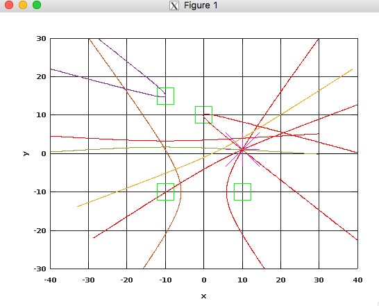

## TDoA math

This is an Octave script that solves the non-linear TDoA equations to find x,y,z coordinates of the TAG given the time differences of arrival and anchors locations.

The script uses `sympy`. To install it on OS X please call:

```sudo pip install --user sympy```

## TDoA visualization for 2D scenario

The script is in the `tdoa_visualize` directory. The sample output looks as follows. This script allows us to understand precisely how the TDoA math works:



Notes:

- The script makes an assumption about the precision of time differences of arrival measurements. It can be modified in line 32 of `tdoa.m`

Next steps:

- perform analysis of location error in different anchor configuration
- find best anchors configuration
- define the minimum time measurement accuracy needed to get satisfying results